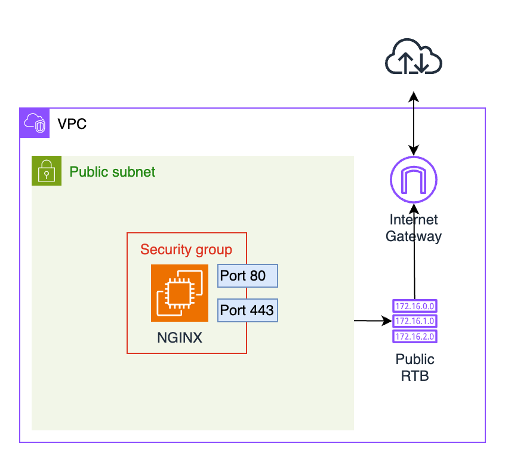

# Deploying an NGINX Server in AWS

In this project, we will be deploying an NGINX server in AWS. We will create a new VPC, set up public and private subnets, and deploy an EC2 instance using the Ubuntu AMI. Later, we will replace the instance with an NGINX Bitnami AMI and associate it with a security group. Finally, we will test the website accessibility and tag the resources with project information. 

## Project Overview

## Desired Outcome

1. Deploy a new VPC in AWS in the region of your choice.
2. Within the VPC, deploy a public and a private subnet.
    1. **Hint:** The public subnet should be associated with a custom route table containing a route to an Internet Gateway.
3. Create a security group that allows traffic only on ports 80 (HTTP) and 443 (HTTPS).
4. Deploy an EC2 instance in the public subnet using the Ubuntu AMI.
5. Delete the previous instance and deploy another EC2 instance using the NGINX Bitnami AMI, since it's free of charge.
6. Associate the deployed NGINX instance with the created security group, and confirm that it's possible to access the website via its public IP.
    1. **Hint:** You will probably get a certificate error if accessing via `https://`. It's safe to ignore the error and proceed to the website.
7. Tag resources with useful information about the project.

Steps for implementation:

1. Deploy a VPC and a subnet
2. Deploy an internet gateway and associate it with the VPC
3. Setup a route table with a route to the IGW and associate it with the subnet
4. Deploy an EC2 instance inside of the created subnet and associate a public IP
5. Associate a security group that allows public ingress
6. Change the EC2 instance to use a publicly available NGINX AMI

